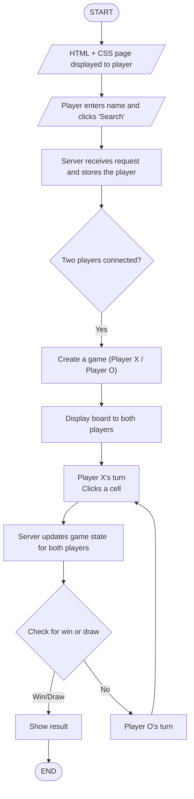

# ❌🔵 Tic-Tac-Toe WebSockets 🔵❌
  

A **Tic-Tac-Toe** game playable in **real-time** between two players via the browser.

This project uses **Node.js, Express, and Socket.IO** to manage player connections and game state.


# Install

**Run**:


```bash

# Clone the repository
git clone https://github.com/mlangumier/websocket-client/tree/test-separation-logic-ameliah

# Navigate to the project folder
cd test-separation-logic-ameliah

# Install dependencies
npm install -g express http nodemon socket.io 

# Start the server
nodemon server.cjs

# Ouvrir 2 fenêtres sur :
# http://localhost:8080

```

---


## 🔗 Features

  

- **Simple  interface** using HTML + CSS

-  **Real-time connection** with Socket.IO

-  **Automatic role assignment** (X and O)

-  **Instant updates** on the game board for both players

-  **Automatic check** for victory or draw

-  **Automatic game reset** after a match

  

---

  

## ▶️ Ressources

**Websocket**
https://www.youtube.com/watch?v=1BfCnjr_Vjg

**Tic-Tac-Toe**
https://www.youtube.com/watch?v=LpSvzaPsnVI
https://www.youtube.com/watch?v=wR8GSFHJ330

**Documentation**
https://developer.mozilla.org/fr/docs/Web/JavaScript
https://socket.io/docs/v4/
https://stackoverflow.com/
et le cours


## 🛠️ Tech Stack


| Component       | Role                                           |
|-----------------|-----------------------------------------------|
| HTML / CSS      | User interface                                |
| JavaScript      | Game logic on the client side                 |
| Node.js         | Backend server                                |
| Express         | Serves/send static files (HTML/CSS/JS)            |
| Socket.IO       | Handles real-time communication between players |


---

  

## 🎮 Game Logic

  


  
  

## ⚡ Express

  

**What is it?** A light framework for Node.js.

  

**Role in this project:**

  

Serves/send static files (HTML, CSS, JS) to the browser.

  

Creates simple routes, to display the game page.

  

**Connection to WebSockets:** Express doesn’t handle real-time communication by itself, but it provides the server base for Socket.IO to run on.

  

## 🔃 Socket.IO

  

**What is it?** A Node.js library that enables real-time communication between the server and browsers.

  

**Role in this project:**

  

Lets both players see moves instantly.

  

Manages events like “player joined”, “move played”, “game over”.

  

**How it works:** Uses WebSockets (with fallback if the browser doesn’t support them) to send and receive data continuously.


**Screenshots**


 
 
 
 
 
 
